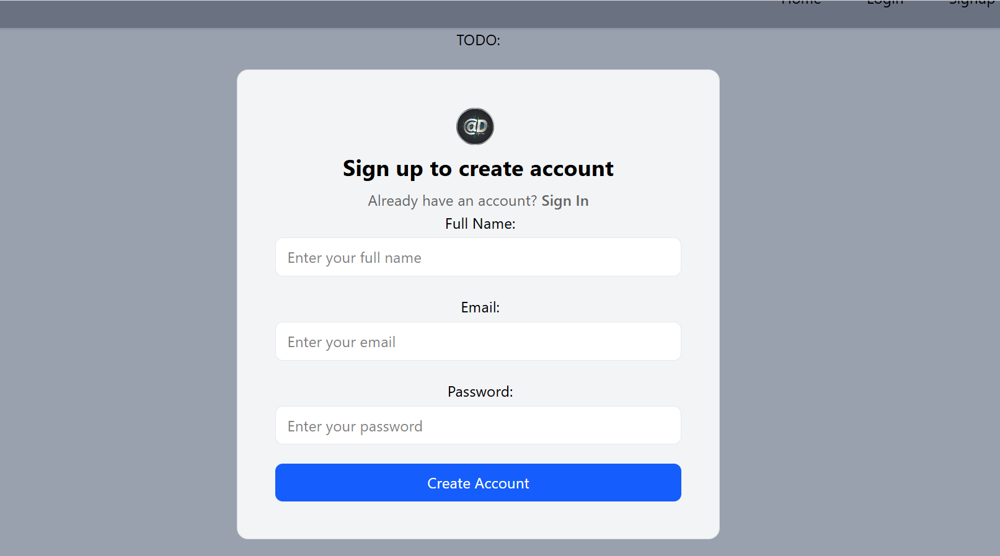
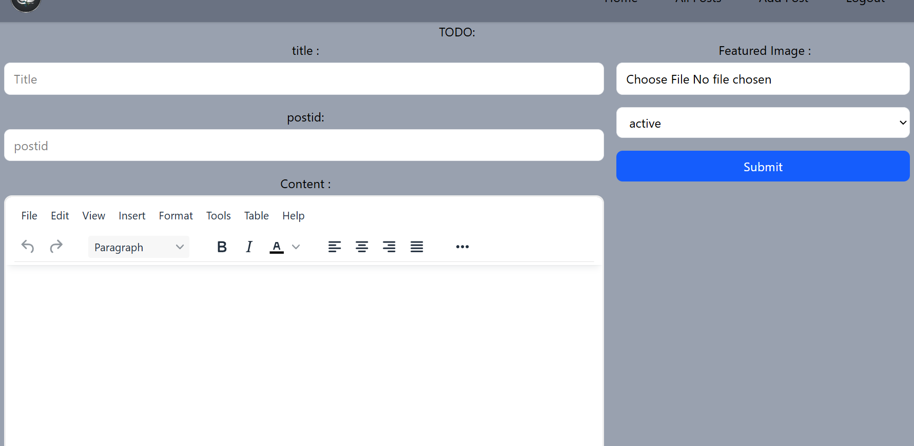

# BlogSphere (  React + Appwrite ) 

A full-stack blogging system where users can create, update, delete, and view blog posts.
Built using React for frontend and Appwrite as backend service.

## Features -:

User Authentication (Signup / Login / Logout)  
Create a new blog post (Title + Content + file)  
Update/Edit your own post  
Delete your post  
View all pos
Only logged-in users can manage posts   
Responsive UI  

## Tech Stack -:

Frontend: React, JavaScript, CSS / Tailwind , HTML   
Backend: Appwrite (Auth + Database)  
Tools: Git, GitHub, Vite  

## Screenshots -:

###  SignUp Page

### Create Post Page
 